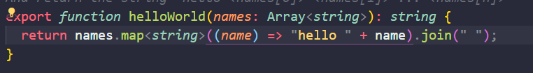

# Near-First-Task

- First of all, install near-cli -> npm install -g near-cli

- Run this project, follow these steps;

```git
  git clone https://github.com/cagridemirtash/near-first-task.git
  yarn
  yarn build:release
  near dev-deploy ./build/release/simple.wasm -> Create ./neardev -> Change value of CONTRACT_NAME from dev.... to your dev account
  Run again -> near dev-deploy ./build/release/simple.wasm
  export  CONTRACT=YOUR_DEV_ACCOUNT_HERE
  near view $CONTRACT <function in CONTRACT> <input JSON>
```
## Task List
- [x] Change helloWorld function to return the string hello + name
- [x] Change this function take a string parameter called name, And return the string hello + name
- [x] Change this function take a Array(string) parameter called names, And return the string hello names[0] hello names[1] ... hello names[n]

## Task Screenshot

### Task 1


### Task 2


### Task 3



## Near & Patika.dev
- This project forked from Learn-NEAR. [Click](https://github.com/Learn-NEAR/starter--near-sdk-as) for go to original repo.
- Also, Thanks [Patika.dev](https://www.patika.dev/) for serve this course.
